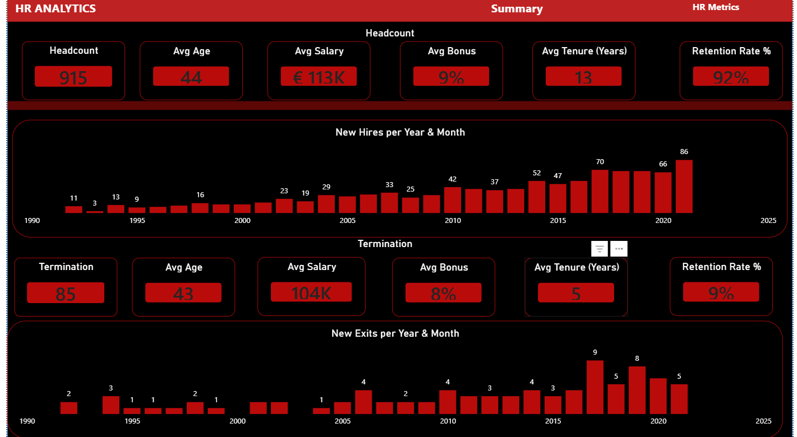
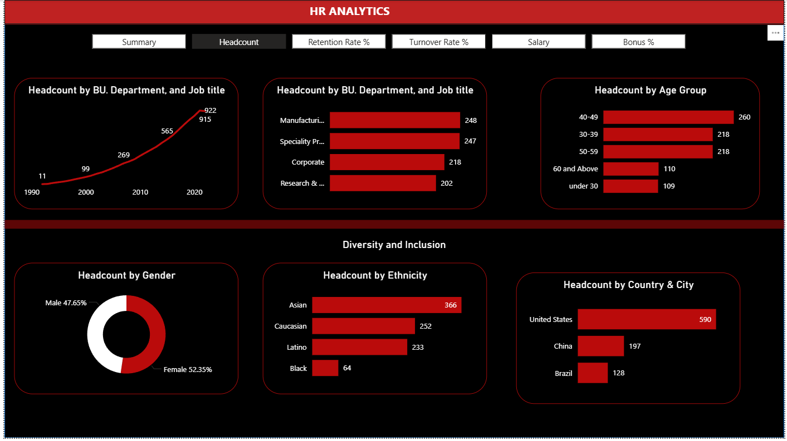
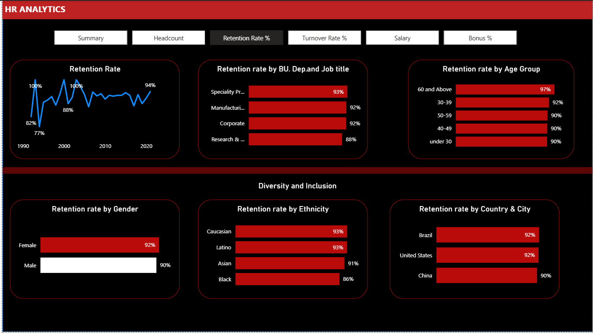
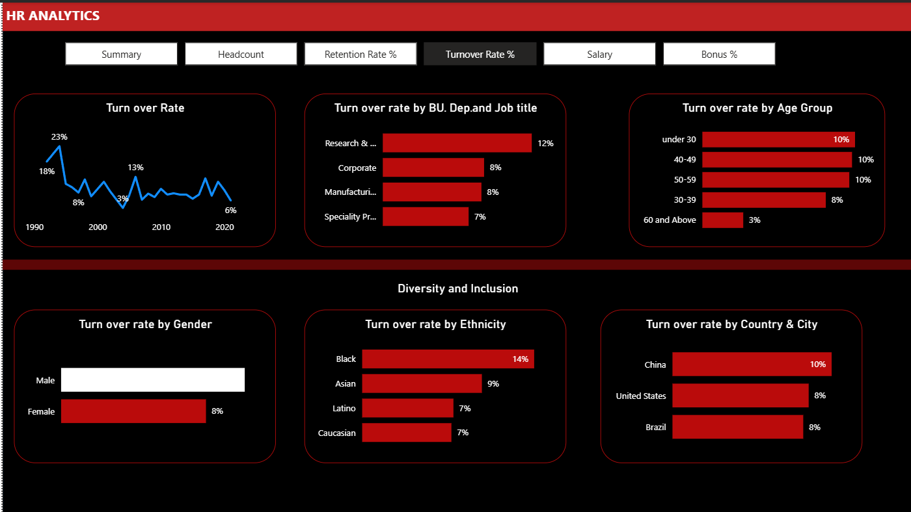
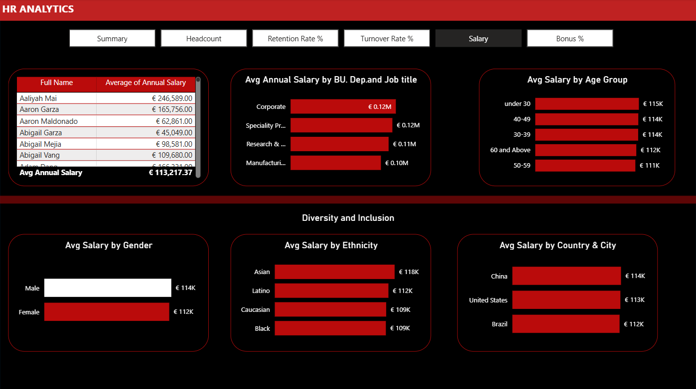
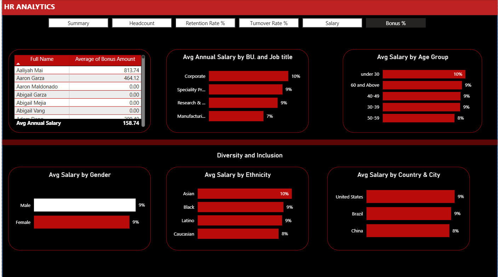

# HR Analytics Dashboard — Power BI

## Project Overview
An HR analytics dashboard built for a fictional organisation's 
HR leadership team and fair labour audit committee. The analysis 
covers workforce demographics, compensation equity, retention 
trends, and turnover patterns across 1,000 employee records 
spanning 1992–2024.

## Business Questions Answered
1. How diverse is the workforce in terms of gender, ethnicity, and age?
2. Is there a correlation between pay levels, departments, and job titles?
3. How about the geographic distribution of the workforce?
4. What is the employee retention rate trend yearly?
5. What is the employee retention rate by gender, ethnicity, and age?
6. Which business unit had the highest and lowest retention rate?
7. Which business unit and department paid the most and least bonuses?
8. What is the annual historical bonus trend?
9. How about pay equity based on gender, ethnicity, and age?
10. What is the employee turnover rate monthly, quarterly, and annually?

## Dataset
- **Source:** [HR Data Analysis FP20C15]
- **Size:** 1,000 rows, 16 columns
- **Period:** 1992 – 2024
- **Grain:** One row per employee

## Data Cleaning
Performed in Power Query:
- Identified 89 rows sharing non-unique EEIDs due to source 
  system data entry errors. Investigated each case — rows 
  contained different employee information confirming they 
  were distinct individuals. Resolved by creating a new 
  UniqueID column. All 1,000 records retained.
- Verified date columns were correctly typed as Date not Text
- Confirmed 914 active employees (blank Exit Date) and 
  86 exited employees
- Standardised country and city naming conventions

> **Data Note:** Only 86 exits recorded across the full date 
> range. Retention and turnover figures reflect this limited 
> exit count. Pre-2000 retention rates reflect fewer than 
> 20 employees and should be interpreted with caution.

## DAX Measures Built
- Active Headcount
- Total Headcount
- Separations
- Retention Rate %
- Turnover Rate %
- Avg Age at Exit
- Avg Tenure at Exit
- Avg Salary at Exit
- Avg Bonus at Exit
- Bonus Amount (calculated column)
- Tenure Years (calculated column)
- Age Band (calculated column)

## Dashboard Pages
### 1. Summary

### 2. Headcount

### 3. Retention Rate

### 4. Turnover Rate

### 5. Salary

### 6. Bonus

## Key Findings
- Overall retention rate is **91.4%** with only 86 recorded 
  exits across 30 years
- Black employees show a **86% retention rate** compared to 
  91–93% for other ethnic groups — flagged for HR leadership 
  review
- Specialty Products business unit shows the highest retention 
  at 93%; Research & Development the lowest at 88%
- Female employees show slightly higher retention (92%) than 
  Male (90%)
- Employees aged 60 and above show the highest retention at 97%

## Tools Used
- Power BI Desktop
- Power Query (data cleaning)
- DAX (measures and calculated columns)

## Author
Amaka Ibeh

**Part of:** [Data Analytics Portfolio](https://github.com/IbehAmaka) by Amaka Ibeh  
**This system powers the AI Insights page of:**  
→ [Power BI Global B2B Sales Pipeline Dashboard](https://github.com/IbehAmaka/powerbi-sales-pipeline)  
**Other projects:** [Starbucks Climate Risk](https://github.com/IbehAmaka/starbucks-climate-risk-analysis) · [German Banking SQL](https://github.com/IbehAmaka/german-banking-sql-analysis)
